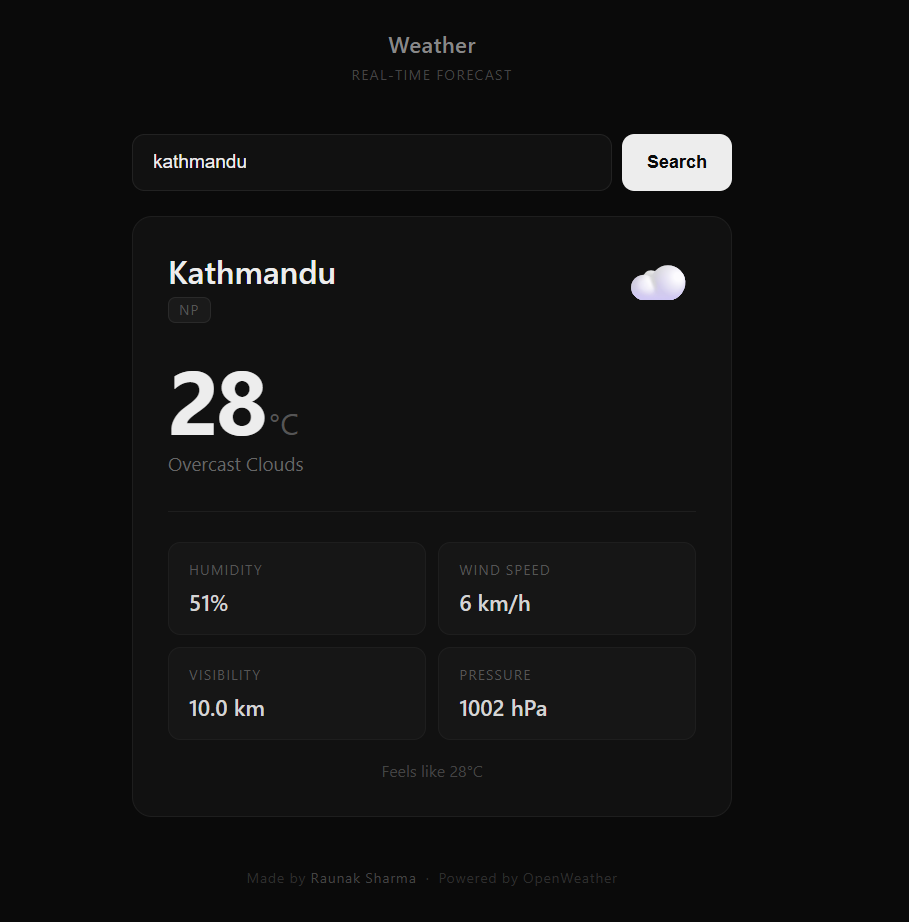

# weather app 🌤️

a minimal, real-time weather app built with vanilla html, css & javascript.

## features
- 🔍 search any city worldwide
- 🌡️ temperature, feels like, humidity, wind, pressure & visibility
- 🎨 vercel-inspired dark ui with smooth animations
- 📱 fully responsive

## tech stack
- html / css / javascript
- openweather api

## live demo
[view live →](https://raunak77711.github.io/weather_web)

---
made by **raunak sharma**
